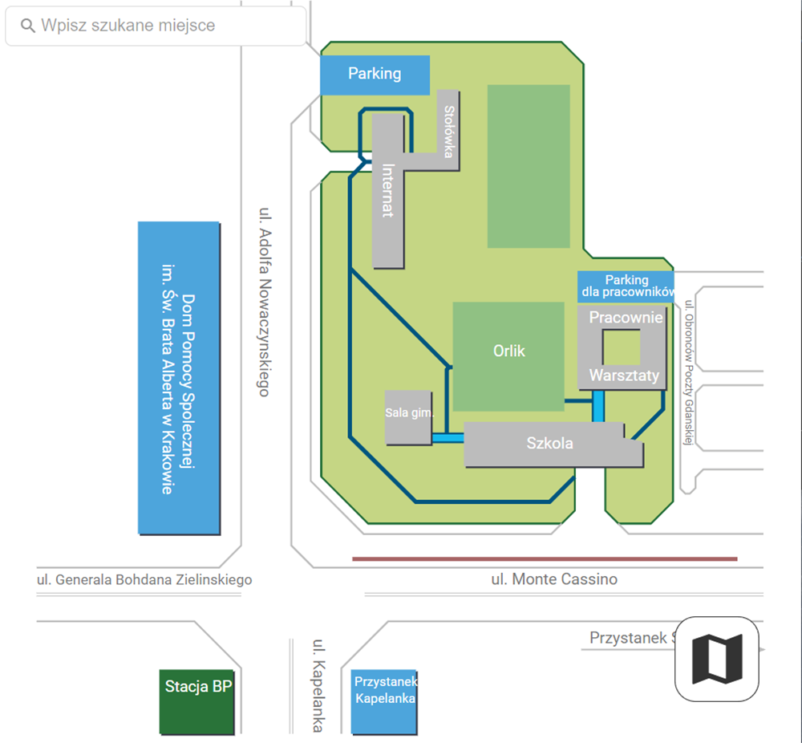
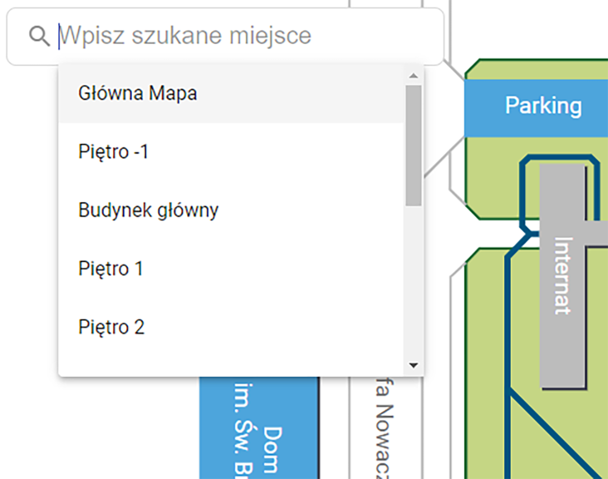

# NewMap2022

This is a representation of my school map with a simple design, routing and description of every object. \
Features:

* Whole map overview \
  
* Search bar with autocomplete \
  
* Details section \
  
* Floor navigation \
  

Dokumentacja projektu:

Katalog src zawiera wszystkie pliki projektu. Wszystko opiera się na angularze i różnych modułach do niego dobranch.

/src\
--/app //kod aplikacji\
----/components\
------/details-field //okno wysuwane z lewej-konieczne komentarze w plikach
------/level-manager //kontoler pięter -konieczne komentarze w plikach
------/search-bar //wyszukiwarka -konieczne komentarze w plikach
----/services\
------/data.service.ts //service odpowiedzialny za sale i piętra\
------/details.service.ts //service aktualizujący dane po kliknięciu na sprawdzenie lokalizacji\
----/views //componenty, które są renderowane przez mape-inaczej nie da się umieścić interaktywnego svg\
------/view.component.ts //opis w kodzie\
----/app.components.css //główne style aplikacji\
----/app.components.html //główny plik html-wszystkie componenty do nawigacji się tu znajdują\
----/app.components.ts //plik wytłumaczony w kodzie\
----/app.module.ts //standardowa budowa dla angular-wszystko jasne\
----/app-routing.module.ts //standardowa budowa dla angular-wszystko jasne\
--/assets //wszystkie pliki statyczne aplikacji\
--/environments //katalog generowany przez angular

W pliku /assets/database.json trzeba dodać kolejne rekordy z bazy danych: \
Przykładowo: \

{\
"title": "Sala Gimnastyczna", <--Nazwa elementu klikanego\
"ids": [

"176inactiveG", <--jest to nazwa elementu z svg który reaguje na klik\
"176inactiveGt" <--kolejny element-ponieważ niektóre sale w svg składają się z kilku elementów

W powyższym przypadku na klik reaguje kwadrat oraz tekst na nim

],\
"highlight": [ <--elementy podświetlane na zielono po kliku\
"176inactiveG" <--element podświetlany-kwadrat ale już bez tekstu\
],\
"description": "Ktos tu cwiczy?", <-- opis tej sali\
"imgUrl": "/assets/img/gym.png", <--ścieżka do obrazka, który wyświetli się po otwarciu detali sali\
"route": "/" <--ścieżka na którą przekierowuje np. budynek Przykładowo: Klik w warsztaty przekierowuje na widok
warsztatów\
},
